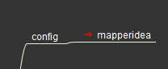
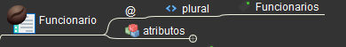
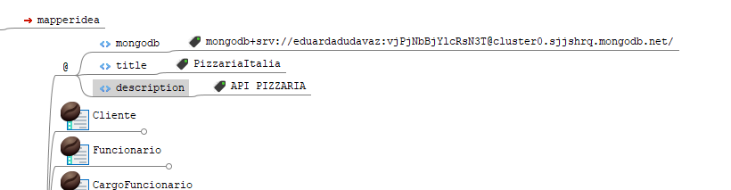

# Geração de o codigo

## 1. No seu mapa de negocio você vai precisar Linkar o mapa `mapperidea.mm`

<br>

 - Para fazer isso você vai no mapa de negocio, no nó config, você vai adicionar o nó filho chamado mapperidea. Dentro desse nó você vai adicionar o atributo `path` com o valor `mapperidea.mm`

- **importante: o arquivo `mapperidea.mm` deve estar na mesma pasta do arquivo seu mapa de negocio**

<br>

<p align="center">
    
</p>

<br>

- Agora resta dar **push** no seu mapa

<br>


## 2. Gerar o codigo bash

- Dar o comando:

```bash
mi g app mean bashGenerateAll > generateAll.sh
```

- Ir no terminal e dar o comando:

```bash
./generateAll.sh
```

<br>

## Importante

<br>

### 1. Nome do seu mapa

<br>

- O nome do seu mapa deve ser **app**. Para isso você vai ter que dar o seguinte comando em seu terminal:

- Estar na pasta do seu mapa de negocio


```bash
mi i app *nomeDoSeuArquivo*
```


- **Exemplo:**

```bash
mi i app mdm.mm
```

### 2. Plural

<br>

- Todas suas classes devem ter uma propriedade plural. Para isso você vai ter que dar o seguinte comando em seu mapa de negocio:

<br>

<p align="center">
    
</p>

### 3. Titulo e link do mongoDb

<br>

- Dentro do package domain é necessario ter uma propriedade para o titulo e para o link do mongo. Para isso você vai ter que dar o seguinte comando em seu mapa de negocio:

<br>

<p align="center">
    
</p>


